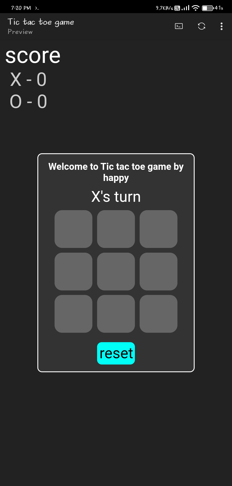
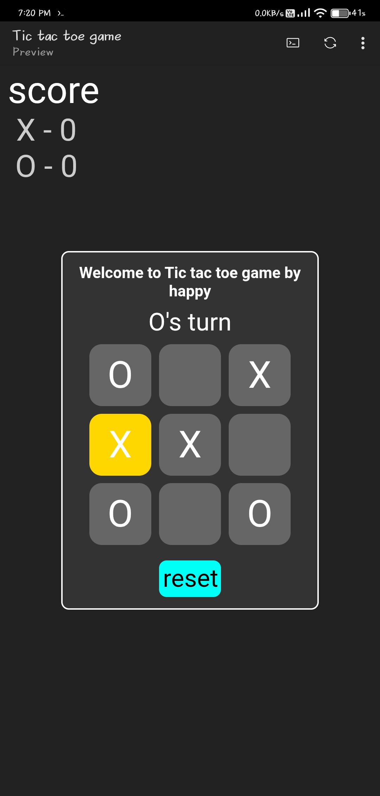
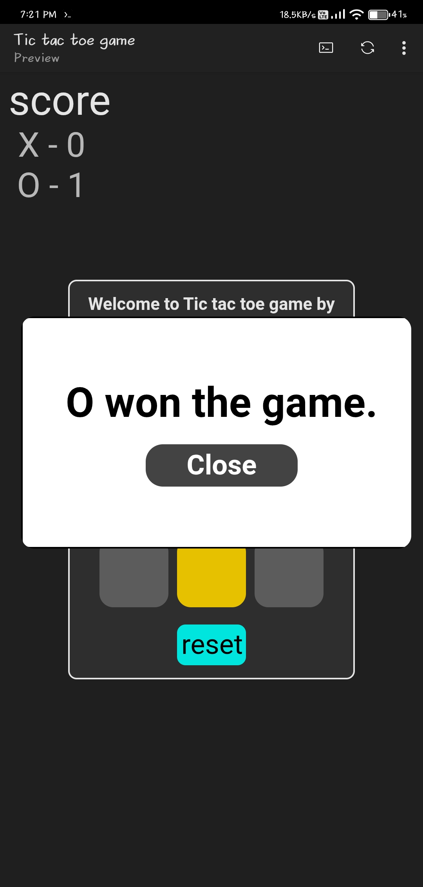
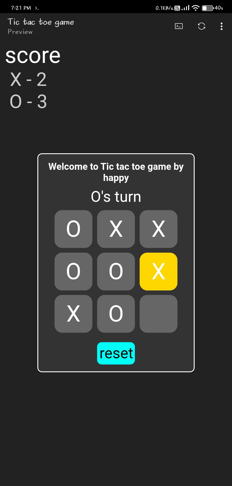

# ❌⭕ Tic-Tac-Toe Game

A simple and interactive Tic-Tac-Toe game built using **HTML**, **CSS**, and **JavaScript**. Play against a friend, keep track of scores, and enjoy a clean, responsive interface.

---

## ✨ Features

- 🎮 Two-player gameplay
- ❌⭕ Automatic turn switching
- 🏆 Winner detection
- 🤝 Draw detection
- 📊 Live scoreboard
- 🔄 Reset game anytime
- 💬 Winner popup using HTML `<dialog>`
- 📱 Mobile-friendly design

---

## 🛠️ Technologies Used

- HTML5
- CSS3
- JavaScript (ES6)

---

## 📂 Project Structure

```text
tic-tac-toe-game/
├── index.html
├── style.css
├── script.js
├── README.md
└── screenshots/
    ├── start.png
    ├── gameplay.png
    ├── winner.png
    └── scoreboard.png
```

---

## 🚀 Getting Started

Clone the repository:

```bash
git clone https://github.com/babuhappy531-lab/tic-tac-toe-game.git
```

Go to the project folder:

```bash
cd tic-tac-toe-game
```

Open **index.html** in your favorite browser.

No installation required.

---

## 🎮 How to Play

1. Open the game.
2. Player **X** starts first.
3. Players take turns placing **X** and **O**.
4. The first player to align three marks horizontally, vertically, or diagonally wins.
5. If all nine cells are filled without a winner, the game ends in a draw.
6. Click **Reset** to start a new game.

---

## 📸 Screenshots

| Start | Gameplay |
|-------|----------|
|  |  |

| Winner | Scoreboard |
|--------|------------|
|  |  |

## 💡 Future Improvements

- 🤖 Single-player mode (AI)
- 💾 Save scores using LocalStorage
- 🔊 Sound effects
- ✨ Winning animations
- 🎉 Confetti celebration
- 🌙 Dark/Light mode
- 🌐 Online multiplayer

---

## 📚 What I Learned

- DOM Manipulation
- Event Listeners
- Arrays & Loops
- Functions
- Conditional Logic
- Game State Management
- Responsive Web Design

---

## 👨‍💻 Author

**Happy**

GitHub: https://github.com/babuhappy531-lab

---

⭐ If you enjoyed this project, consider giving it a star!
